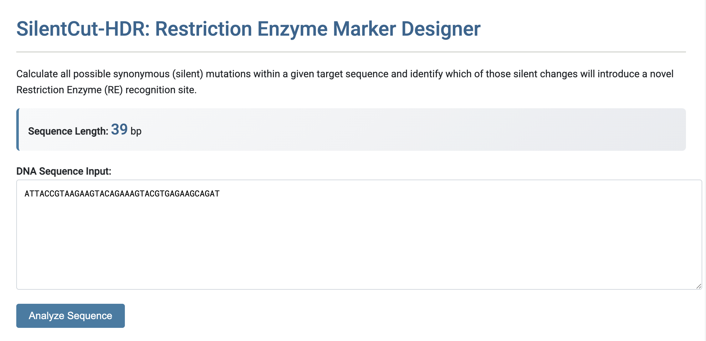
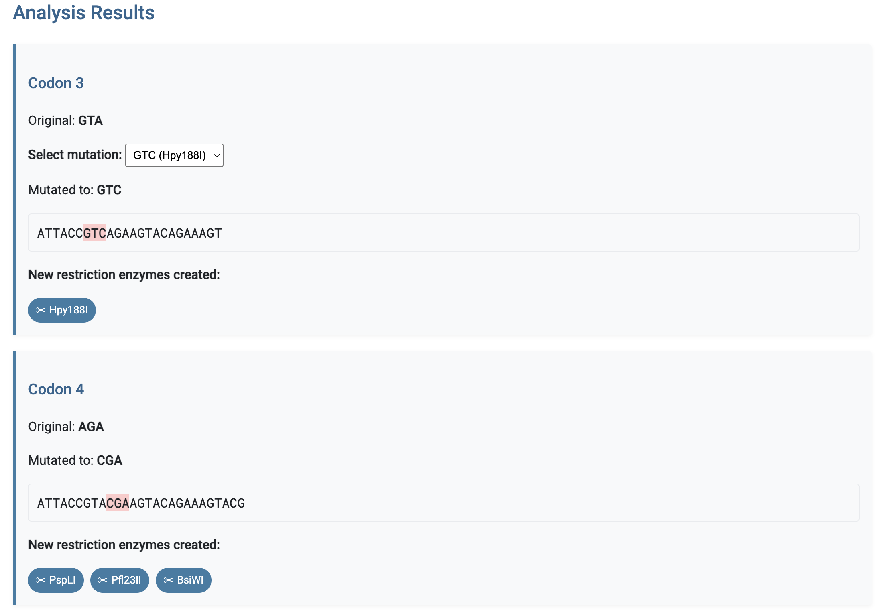
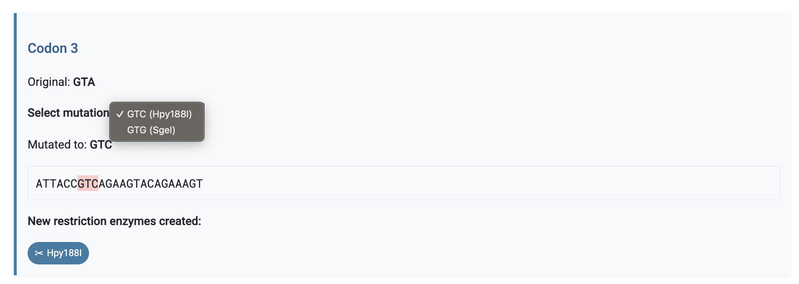
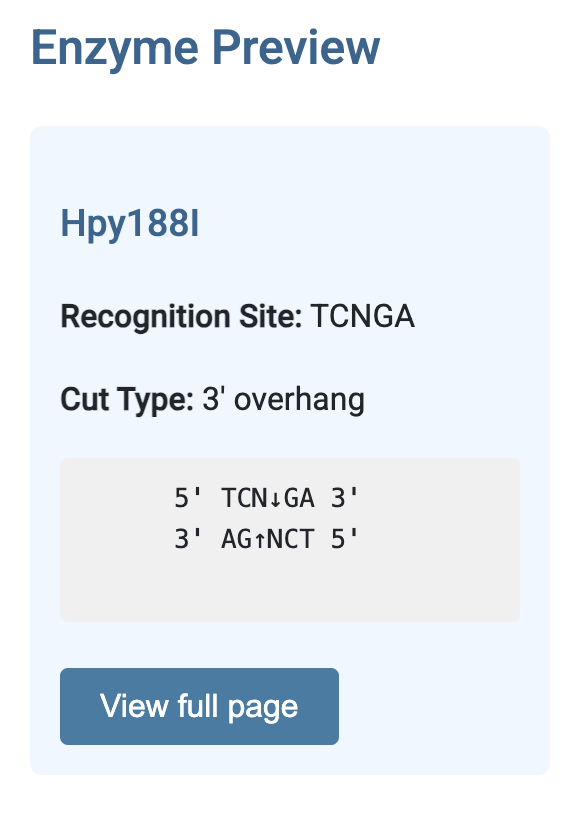
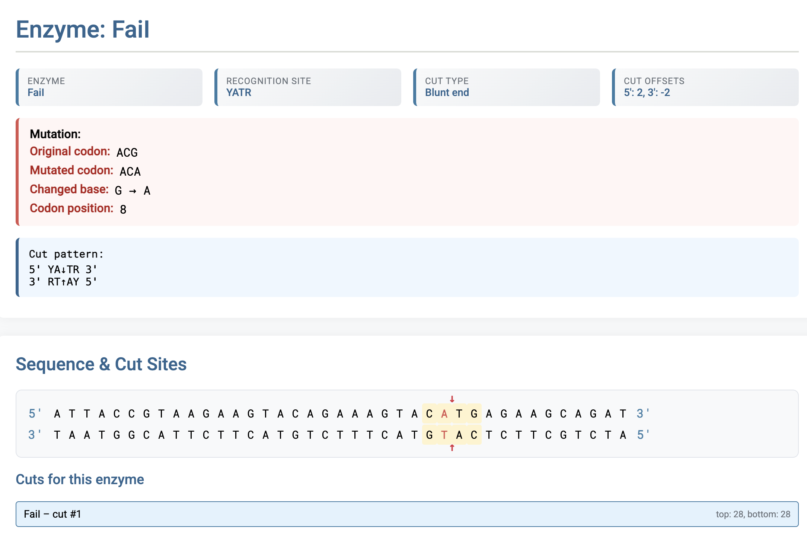

# SilentCut-HDR: Restriction Enzyme Marker Designer
SilentCut-HDR is a straightforward web application designed to accelerate the screening process for CRISPR Homology Directed Repair (HDR) experiments. It automatically calculates all possible synonymous (silent) mutations within a given target sequence and identifies which of those silent changes will introduce a novel Restriction Enzyme (RE) recognition site. The application's core value is suggesting the ideal Restriction Enzyme site change within the target sequence, enabling researchers to quickly confirm successful gene integration using a simple, cost-effective RE digest of bulk-edited cells. Developed in Python, the application uses FastAPI for its web interface and relies on the robust functionality of Biopython for all sequence and enzyme calculations.

# Installation
This application is built using Python 3.8+, FastAPI, and Biopython. We highly recommend using a virtual environment (venv) to keep dependencies isolated. Follow these five steps to get the application running on your local machine:

1. Clone the repository from GitHub
   
```
git clone https://github.com/evona87/SilentCut-HDR.git
cd SilentCut-HDR
```
2. Create and activate a Python virtual environment. This ensures dependencies don't interfere with other Python projects. (optional)

```
python3 -m venv SilentCut
source SilentCut/bin/activate  # Use 'SilentCut\Scripts\activate' on Windows
```

3. Install all required dependencies. We install FastAPI (the framework), uvicorn (the ASGI server), and Biopython (for sequence analysis).
```
pip install fastapi uvicorn 'biopython[full]' pydantic python-multipart 'fastapi-utils'
```

4. Start the FastAPI server. This command runs the uvicorn server, pointing it to the 'app' object inside the 'backend.py' file and reloading every time a change is made.
```
uvicorn backend:app --reload
```
5. Open index.html in your web browser
   
# How to Use
1. Input the Target Sequence: Add the coding sequence where you wish to introduce a silent mutation and subsequent cut site.

<div align="center" style="margin-top: 15px; margin-bottom: 200px;">

</div>

2. View Initial Results: The tool displays all synonymous codon options that successfully create a new Restriction Enzyme recognition site.

<div align="center" style="margin-top: 15px; margin-bottom: 200px;">

</div>

3. Select Alternative Codons: If multiple synonymous mutations are possible for a single codon, you can use the provided dropdown menu to select the specific codon change you are interested in.

<div align="center" style="margin-top: 15px; margin-bottom: 200px;">

</div>

4. Enzyme Preview and Verification: For a more detailed preview of the enzyme's cut site, click on the desired enzyme and navigate to the left side of the page, where the cut site is visualized.

<div align="center" style="margin-top: 15px; margin-bottom: 200px;">

</div>

5. By clicking “View Full Page,” you can see the exact cut position within the codon sequence, together with additional detailed information about the enzyme.
<div align="center" style="margin-top: 15px; margin-bottom: 200px;">

</div>

Important Note: Alternatively, you can take the enzyme and visualize its cut site in an external tool like Benchling. This is highly recommended to ensure the cut is specific only to your introduced mutation and that no pre-existing cutting sides in the whole PCR Product that will be used for your mutation screening will cause unwanted multiple fragments in downstream analysis/gel electrophoresis.
